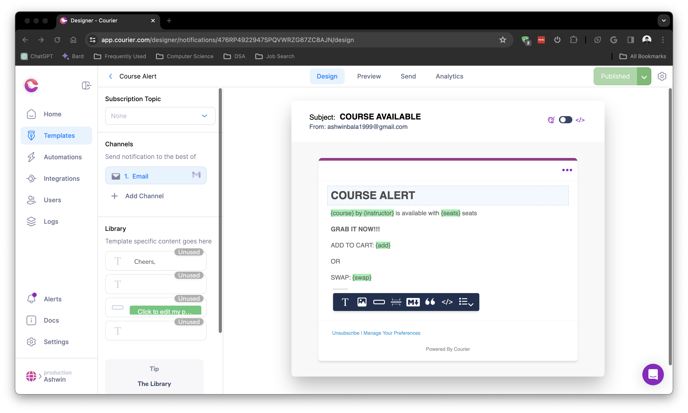
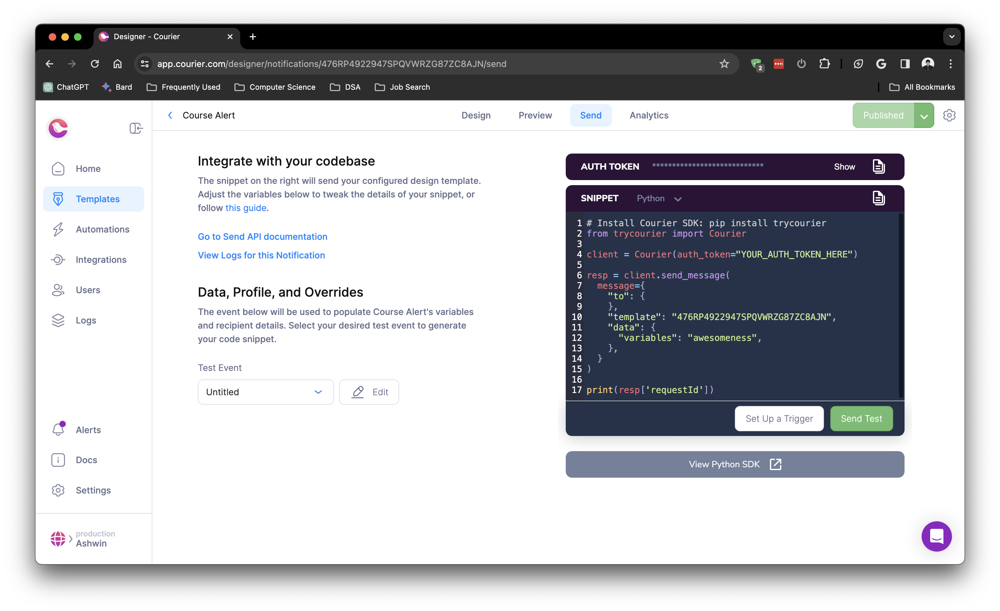

# ASU Course Alert

A Python script designed to efficiently monitor the availability of specified courses at Arizona State University. Running at one-minute intervals, the script systematically checks the course status, providing real-time Telegram and Email notifications when any of the targeted courses become open for enrollment. This integrated feature ensures that students are promptly informed of course availability, optimizing their registration experience with efficient and customizable alerts through both messaging platforms.

## Setup Courier and Telegram Bot
### Courier
1. Create an account in [Courier](https://www.courier.com/).
2. Create a Template as shown below:

3. Goto the ```Send``` tab and copy the ```AUTH_TOKEN``` from the top right corner and the ```template``` id from the code:

Paste them in your ```.env``` file as ```COURIER_API_KEY``` and ```COURIER_TEMPLATE_ID``` respectively.
4. Finally, update ```TARGET_MAIL``` in your ```.env``` file where you would like to recieve the email alert.

### Telegram Bot
1. Create a new Telegram bot:
- start a chat with BotFather;
- type ```/newbot```, select a name (to be shown in chats) and handle for your bot;
- note the bot token to access HTTP API - a long string with a colon in the middle (later referred to as ```TELEGRAM_TOKEN``` in your ```.env``` file);
optionally ```/setdescription``` and ```/setuserpic```.

2. Add the bot to the chat/channel and note its id:
- add the bot to a new or existing chat or group - this is where your bot will send notifications to;
- go to ```https://api.telegram.org/bot<TELEGRAM_TOKEN>/getUpdates``` (replace ```<TELEGRAM_TOKEN>``` with your token);
- within the ```chat``` part, find and note the ```id``` field - a positive or negative number (referred to as ```TELEGRAM_CHAT_ID``` in your ```.env``` file).
